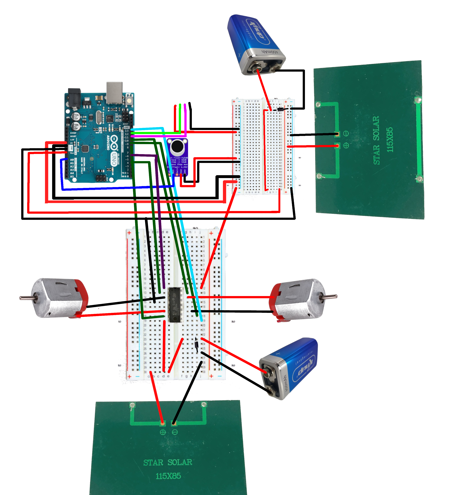

# Neosymbiota lucens

Instruções de montagem para o trabalho Neosymbiota lucens de Licida Vidal.

## Funcionalidades 

Integração de Arduino UNO com

* Placa solar: [ref 1](https://www.paraisodosbits.com.br/2016/11/09/usando-o-arduino-com-painel-solar/), [ref 2](https://www.instructables.com/Self-Sufficient-Arduino-Board/), [ref 3](https://docs.arduino.cc/learn/electronics/power-pins/)
* Motores DC com controlador L293D [ref 1](https://lastminuteengineers.com/l293d-dc-motor-arduino-tutorial/)
* Bomba aquática submersível: [ref 1](https://www.youtube.com/watch?v=HBGYIuBC3BQ), [ref 2](https://www.youtube.com/watch?v=yZqnqxHI59Q)
* Sensor supersônico para medir distância: [ref 1](https://portal.vidadesilicio.com.br/hc-sr04-sensor-ultrassonico/), [ref 2](https://www.blogdarobotica.com/2025/01/29/como-utilizar-o-sensor-ultrassonico-de-distancia-jsn-sr04t-aj-sr04m-com-arduino/), [ref 3](https://www.usinainfo.com.br/blog/projeto-sensor-jsn-sr04t-2-0-aj-sr04m-comunicacao-com-arduino/?srsltid=AfmBOopvsdUFvlvj2USKoAfYu04oJpcviJmg7YlTh83QradhTHyfNF62)
* Microfone para capturar frequência chamando: [ref 1](https://www.youtube.com/watch?v=59TqCV6DtKA), [ref 2](https://circuitdigest.com/microcontroller-projects/how-to-detect-the-direction-of-sound-using-arduino)
* Extra: Controle remoto para controle manual

## Componentes

Proposta de conexões com microfone, motor, sensor de distância e placa solar
* L293D - Controlador dos motores DC
  * Motor DC 
    * IN1: 4
    * IN2: 8
    * ENABLE: 6
  * Motor DC 
    * IN1: 9
    * IN2 10
    * ENABLE: 13
* Microfone Out: A0
* Sensor Ultrassonico 
  * Echo: 11
  * Trig: 12
* Sensor Ultrassonico
  * Echo: 5
  * Trig: 7 
**Atenção ao energizar o arduino pelo VIN**
**Testes com motor DC usando fonte de 5V 2.3A**

* 1 [Sensor de distância ultrassônico](https://www.mercadolivre.com.br/sensor-ultrassonico-sr04m2-a-prova-dagua/up/MLBU780261499#polycard_client=search-nordic&searchVariation=MLBU780261499&wid=MLB4829711926&position=18&search_layout=grid&type=product&tracking_id=064d24b2-a8ea-4c77-a8be-2f44691eaf4e&sid=search)
* 1 [Microfone](https://produto.mercadolivre.com.br/MLB-3527016353-modulo-microfone-max4466-ganho-ajustavel-arduino-pic-esp-_JM#polycard_client=search-nordic&position=27&search_layout=stack&type=item&tracking_id=2258674f-dd40-4e4d-8389-b0f20a669a16&wid=MLB3527016353&sid=search)
* 2 Motores DC + controlador L293D
* 1 [Arduino UNO](https://produto.mercadolivre.com.br/MLB-3697545915-placa-compativel-uno-atmega328-ch340-cabo-usb-_JM?vip_filters=shipping%3Afulfillment&pdp_filters=shipping%3Afulfillment#polycard_client=search-nordic&position=25&search_layout=grid&type=item&tracking_id=cc0801a4-f82f-4d73-bb1e-b4bf85861dad&wid=MLB3697545915&sid=search)
* 2 [Placa solar](https://produto.mercadolivre.com.br/MLB-3197175720-mini-painel-placa-solar-12v-15w-energia-fotovoltaica-celula-_JM#polycard_client=recommendations_vip-v2p&reco_backend=ranker_retrieval_online_vpp_v2p&reco_model=coldstart_high_exposition%2C+coldstart_low_exposition%2C+rk_online_v1_retsys_vpp_v2p&reco_client=vip-v2p&reco_item_pos=0&reco_backend_type=low_level&reco_id=5b90ecaf-89f2-4e3c-a35a-a18b5d9ecafb&wid=MLB3197175720&sid=recos)
* 2 [Bateria](https://www.mercadolivre.com.br/kit-2-baterias-recarregavel-9-volts-knup-9v-450mah-original/p/MLB28098757#polycard_client=search-nordic&searchVariation=MLB28098757&wid=MLB4590869610&position=1&search_layout=grid&type=product&tracking_id=d9cdf780-80d9-457f-a0d0-a9f6de75f557&sid=search)
* 2 [Diodo 1n4001](https://www.mercadolivre.com.br/kit-25-unidades-diodo-retificador-1n4001-do-41/p/MLB51002766#polycard_client=search-nordic&searchVariation=MLB51002766&wid=MLB4087392627&position=1&search_layout=grid&type=product&tracking_id=80f1e4d0-07be-4bdd-947b-ced9f5320ad4&sid=search)
* 2 [Protoboard](https://produto.mercadolivre.com.br/MLB-1283722785-10-mini-protoboard-breadboard-170-pontos-furos-pinos-arduino-_JM#polycard_client=search-nordic&position=35&search_layout=grid&type=item&tracking_id=79e20459-a42e-4104-a06e-2b2462446bd3&wid=MLB1283722785&sid=search)
* [Jumpers (cabos conectores)](https://produto.mercadolivre.com.br/MLB-3626514181-kit-cabo-jumper-macho-macho-macho-femea-femea-femea-120x-_JM#polycard_client=search-nordic&position=7&search_layout=grid&type=item&tracking_id=be4dda6d-7024-42d3-8310-fec3944a5003&wid=MLB3626514181&sid=search)